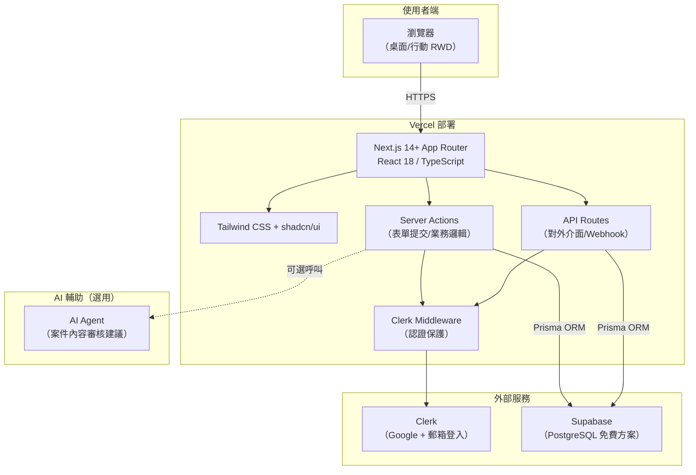

# 接案平台 MVP 系統架構設計

---

## 一、技術架構總覽

### 1.1 架構全景圖



### 1.2 技術棧

| 層級 | 技術 | 版本 | 說明 |
|------|------|------|------|
| **前端框架** | Next.js | 14+ | App Router，React Server Components |
| **UI 庫** | React | 18 | 客戶端互動元件 |
| **型別** | TypeScript | 5+ | Strict mode |
| **樣式** | Tailwind CSS | 3+ | Utility-first CSS |
| **元件庫** | shadcn/ui | latest | Headless Radix UI 元件 |
| **認證** | Clerk | latest | Google OAuth + 郵箱登入 |
| **ORM** | Prisma | 5+ | PostgreSQL ORM，型別安全 |
| **資料庫** | Supabase PostgreSQL | latest | 500MB 免費方案 |
| **驗證** | Zod | 3+ | Server-side + Client-side 驗證 |
| **部署** | Vercel | - | 前端 + Server Actions |
| **檔案儲存** | URL 欄位 | - | MVP 階段不實作檔案上傳 |
| **AI（選用）** | OpenAI / Claude API | - | Agent 輔助審核案件詳情 |

### 1.3 為什麼選擇此架構

| 決策 | 理由 |
|------|------|
| **Next.js App Router** | React Server Components 減少客戶端 JS；內建 Server Actions 無需獨立後端 |
| **Clerk** | 託管式認證，內建 Google OAuth / 郵箱登入、Session 管理、Middleware 保護，開發效率最高 |
| **Prisma + PostgreSQL** | 型別安全的 ORM，Schema 即文件；更換資料庫只需改連線字串 |
| **Supabase** | 免費 500MB PostgreSQL，內建 Dashboard，與 Prisma 相容 |
| **shadcn/ui + Tailwind** | 無 runtime 成本，元件原始碼可控，RWD 開發便捷 |
| **Zod** | Server-side 驗證確保資安，前後端共用 Schema |

---

## 二、前端架構設計

### 2.1 路由設計

```
/                               # 首頁（公開）
├── /sign-in                    # Clerk 登入頁
├── /sign-up                    # Clerk 註冊頁
├── /projects                   # 案件列表（公開）
│   └── /[projectId]            # 案件詳細（公開檢視，操作需登入）
├── /onboarding                 # 首次登入引導（需登入）
├── /dashboard                  # 個人儀表板（需登入）
├── /projects/new               # 發布案件（需登入，發案方）
├── /projects/[projectId]
│   ├── /edit                   # 編輯案件（發案方，限 DRAFT/OPEN）
│   ├── /apply                  # 申請案件（接案者）
│   ├── /applications           # 查看申請者（發案方）
│   ├── /submit                 # 提交成果（接案者）
│   ├── /review-submission      # 驗收成果（發案方）
│   └── /review                 # 評價（雙方）
└── /admin                      # 管理員後台（需登入 + isAdmin）
    ├── /users                  # 使用者管理
    ├── /projects               # 案件管理
    ├── /categories             # 分類管理（REQ-27）
    ├── /skill-tags             # 技能標籤管理（REQ-27）
    ├── /reports                # 舉報管理（REQ-26）
    ├── /disputes               # 糾紛記錄（REQ-30）
    ├── /announcements          # 公告管理（REQ-29）
    └── /settings               # 審核開關設定（REQ-28）
```

### 2.2 元件樹

```
Layout
├── Navbar（Logo + 導航 + 使用者頭像/登入按鈕）
├── Main
│   ├── HomePage
│   │   ├── HeroSection
│   │   ├── FeatureCards
│   │   └── HotProjectsPreview
│   ├── ProjectListPage
│   │   ├── SearchBar
│   │   ├── FilterGroup（分類/技能/狀態）
│   │   ├── ProjectCard[]
│   │   └── Pagination
│   ├── ProjectDetailPage
│   │   ├── Breadcrumb
│   │   ├── ProjectInfo（完整欄位）
│   │   ├── ClientInfoCard
│   │   └── ActionButton（依角色/狀態動態顯示）
│   ├── DashboardPage
│   │   ├── Sidebar
│   │   ├── StatCard[]
│   │   └── ProjectQuickList
│   ├── OnboardingPage
│   │   ├── StepIndicator
│   │   ├── Step1_BasicInfo
│   │   ├── Step2_Skills
│   │   └── Step3_RoleSelect
│   ├── ProjectFormPage
│   │   ├── FormSection（名稱/分類/背景/敘述/交付/驗收）
│   │   ├── BudgetInput（金額 + 幣別下拉）
│   │   ├── SkillTagInput（分類推薦 + 自由輸入）
│   │   ├── AIReviewButton（Agent 輔助審核，可選）
│   │   └── DraftSaveButton + PublishButton
│   ├── ApplicationPage
│   │   ├── ApplicationForm
│   │   └── DynamicUrlList
│   ├── ApplicationsListPage
│   │   ├── ApplicantCard[]
│   │   └── ConfirmDialog
│   ├── SubmissionPage
│   │   ├── SubmissionForm
│   │   └── DynamicUrlList
│   ├── ReviewSubmissionPage
│   │   ├── ComparisonPanel（左：需求 / 右：成果）
│   │   └── AcceptButton / ReviseDialog
│   └── ReviewPage
│       ├── StarRating
│       └── ReviewForm
└── Footer
```

### 2.3 狀態管理策略

| 場景 | 方案 | 理由 |
|------|------|------|
| Server 資料讀取 | React Server Components + `fetch` | Next.js 內建快取與串流 |
| 表單狀態 | React Hook Form + Zod | 高效能驗證與狀態管理 |
| 客戶端 UI 狀態 | React Context / useState | MVP 規模無需全域狀態庫 |
| URL 搜尋/篩選 | `useSearchParams` | 支援 SSR 與分享連結 |

---

## 三、後端架構設計

### 3.1 Server Actions 職責分配

Server Actions 是 Next.js 的內建遠端程序呼叫機制，負責所有表單提交與業務邏輯：

| 領域 | Server Action | 權限檢查 |
|------|-------------|----------|
| **案件** | `createProject`, `updateProject`, `publishProject`, `cancelProject`, `disableProject` | 發案方/管理員 |
| **申請** | `applyProject`, `selectFreelancer` | 接案者/發案方 |
| **提交** | `submitWork`, `acceptSubmission`, `requestRevision` | 接案者/發案方 |
| **評價** | `submitReview` | 雙方 |
| **舉報** | `submitReport`, `handleReport` | 登入使用者/管理員 |
| **分類/標籤** | `createCategory`, `updateCategory`, `deleteCategory`, `createSkillTag`, `updateSkillTag`, `deleteSkillTag` | 管理員 |
| **公告** | `createAnnouncement`, `updateAnnouncement`, `deleteAnnouncement` | 管理員 |
| **糾紛** | `createDispute`, `updateDispute` | 管理員 |
| **審核設定** | `updateReviewSetting` | 管理員 |
| **使用者** | `disableUser`, `enableUser` | 管理員 |

### 3.2 安全設計

```typescript
// 每一層都要驗證
┌─────────────────────────────────────────────────┐
│  1. Clerk Middleware（路由保護）                    │
│     - publicRoutes: ["/", "/projects", "/sign-in"]│
│     - 其餘路由需登入                                │
├─────────────────────────────────────────────────┤
│  2. Server Action 入口驗證                         │
│     - auth().protect() 確認 Session              │
│     - 提取 userId                                  │
├─────────────────────────────────────────────────┤
│  3. 業務權限檢查                                   │
│     - 是否為資源擁有者？                             │
│     - 是否為管理員？                                │
│     - 操作是否符合狀態機？                           │
├─────────────────────────────────────────────────┤
│  4. Zod 輸入驗證                                   │
│     - Server-side 二次驗證                         │
│     - 防範惡意輸入                                 │
└─────────────────────────────────────────────────┘
```

### 3.3 API Routes（選用）

部分場景需使用 API Routes（`/api/*`）：
- Webhook 接收端點（如 Clerk webhook 同步使用者）
- 外部服務整合（如 AI Agent 回呼）

---

## 四、資料庫設計（Prisma Schema）

### 4.1 完整 Schema

```prisma
// =====================================================
// 檔案：prisma/schema.prisma
// 專案：freelancer_platform_mvp
// 資料庫：PostgreSQL (Supabase)
// 說明：接案平台 MVP 完整資料模型，單一真相來源
// =====================================================

generator client {
  provider = "prisma-client-js"
}

datasource db {
  provider = "postgresql"
  url      = env("DATABASE_URL")
}

// =====================================================
// 一、全域枚舉
// =====================================================

enum UserRole {
  CLIENT      // 發案方
  FREELANCER  // 接案者
  BOTH        // 兩者皆是
}

enum UserStatus {
  ACTIVE      // 啟用中
  DISABLED    // 已停用
}

enum ProjectStatus {
  DRAFT                // 草稿
  OPEN                 // 開放申請
  IN_PROGRESS          // 進行中
  SUBMITTED            // 已提交成果
  REVISION_REQUESTED   // 要求修改
  COMPLETED            // 已完成
  CANCELLED            // 已取消
  DISABLED             // 管理員停用
}

enum Currency {
  TWD   // 新台幣
  USD   // 美元
  JPY   // 日圓
  HKD   // 港幣
  CNY   // 人民幣
}

enum ApplicationStatus {
  PENDING   // 審核中
  ACCEPTED  // 已錄取
  REJECTED  // 已拒絕
}

enum ReportStatus {
  PENDING       // 待處理
  UNDER_REVIEW  // 審理中
  RESOLVED      // 已解決
  DISMISSED     // 已駁回
}

enum DisputeStatus {
  OPEN          // 未處理
  UNDER_REVIEW  // 審理中
  RESOLVED      // 已解決
}

enum ReviewSettingType {
  USER_ONBOARDING   // 新使用者 Onboarding 後是否需要人工審核
  PROJECT_PUBLISH   // 案件從 DRAFT 發布為 OPEN 後是否需要人工審核
}

// =====================================================
// 二、使用者模型
// =====================================================

model User {
  id                  String        @id @default(cuid())
  clerkId             String        @unique
  email               String        @unique
  name                String
  avatarUrl           String?
  bio                 String?
  role                UserRole      @default(BOTH)
  status              UserStatus    @default(ACTIVE)
  isAdmin             Boolean       @default(false)
  onboardingCompleted Boolean       @default(false)
  createdAt           DateTime      @default(now())
  updatedAt           DateTime      @updatedAt

  // 關聯
  skills              UserSkill[]
  ownedProjects       Project[]           @relation("ClientProjects")
  assignedProjects    Project[]           @relation("FreelancerProjects")
  applications        Application[]
  submissions         Submission[]
  givenReviews        Review[]            @relation("Reviewer")
  receivedReviews     Review[]            @relation("Reviewee")
  sentReports         Report[]            @relation("Reporter")
  receivedReports     Report[]            @relation("ReportedUser")
  sentDisputes        Dispute[]           @relation("DisputeReporter")
  receivedDisputes    Dispute[]           @relation("DisputeRespondent")

  @@map("users")
}

// =====================================================
// 三、案件分類（REQ-27）
// =====================================================

model Category {
  id          String     @id @default(cuid())
  name        String     @unique
  description String?
  isActive    Boolean    @default(true)
  sortOrder   Int        @default(0)
  createdAt   DateTime   @default(now())
  updatedAt   DateTime   @updatedAt

  // 關聯
  skillTags   SkillTag[]
  projects    Project[]

  @@map("categories")
}

// =====================================================
// 四、技能標籤（REQ-27）
// =====================================================

model SkillTag {
  id          String   @id @default(cuid())
  name        String   @unique
  categoryId  String?
  isActive    Boolean  @default(true)
  createdAt   DateTime @default(now())
  updatedAt   DateTime @updatedAt

  // 關聯
  category     Category?         @relation(fields: [categoryId], references: [id], onDelete: SetNull)
  projectSkills ProjectSkill[]
  userSkills    UserSkill[]

  @@map("skill_tags")
}

// =====================================================
// 五、案件模型（核心）
// =====================================================

model Project {
  id                       String        @id @default(cuid())
  title                    String
  categoryId               String
  background               String
  description              String
  deliverables             String
  acceptanceCriteria       String

  // === Reward 模型：貨幣 + 金額（多幣別支援） ===
  budget                   Decimal
  currency                 Currency      @default(TWD)

  deadline                 DateTime
  status                   ProjectStatus @default(DRAFT)
  confidentialityRequired  Boolean       @default(false)
  references               String?

  // 發案方
  clientId                 String

  // 被選中的接案者（選定後填入）
  selectedFreelancerId     String?

  // 修改次數追蹤（Q-03）
  revisionCount            Int           @default(0)
  revisionReason           String?

  // 審核機制（REQ-28）
  isApproved               Boolean       @default(true) // 預設自動通過

  createdAt                DateTime      @default(now())
  updatedAt                DateTime      @updatedAt

  // 關聯
  category              Category         @relation(fields: [categoryId], references: [id])
  client                User             @relation("ClientProjects", fields: [clientId], references: [id])
  selectedFreelancer    User?            @relation("FreelancerProjects", fields: [selectedFreelancerId], references: [id])
  projectSkills         ProjectSkill[]
  applications          Application[]
  submissions           Submission[]
  reviews               Review[]
  reports               Report[]
  disputes              Dispute[]

  @@index([clientId])
  @@index([status])
  @@index([categoryId])
  @@index([selectedFreelancerId])
  @@map("projects")
}

// =====================================================
// 六、案件-技能標籤關聯（多對多）
// =====================================================

model ProjectSkill {
  id         String   @id @default(cuid())
  projectId  String
  skillTagId String

  project    Project  @relation(fields: [projectId], references: [id], onDelete: Cascade)
  skillTag   SkillTag @relation(fields: [skillTagId], references: [id], onDelete: Cascade)

  @@unique([projectId, skillTagId])
  @@map("project_skills")
}

// =====================================================
// 七、使用者-技能關聯（多對多）
// =====================================================

model UserSkill {
  id         String   @id @default(cuid())
  userId     String
  skillTagId String

  user       User     @relation(fields: [userId], references: [id], onDelete: Cascade)
  skillTag   SkillTag @relation(fields: [skillTagId], references: [id], onDelete: Cascade)

  @@unique([userId, skillTagId])
  @@map("user_skills")
}

// =====================================================
// 八、申請模型
// =====================================================

model Application {
  id             String            @id @default(cuid())
  projectId      String
  freelancerId   String
  description    String
  approach       String
  estimatedDays  Int
  portfolioUrls  String?           // JSON 字串陣列，如 '["url1","url2"]'
  status         ApplicationStatus @default(PENDING)
  createdAt      DateTime          @default(now())
  updatedAt      DateTime          @updatedAt

  // 關聯
  project        Project           @relation(fields: [projectId], references: [id], onDelete: Cascade)
  freelancer     User              @relation(fields: [freelancerId], references: [id])

  @@unique([projectId, freelancerId]) // 不可重複申請
  @@index([projectId])
  @@index([freelancerId])
  @@map("applications")
}

// =====================================================
// 九、成果提交模型
// =====================================================

model Submission {
  id            String   @id @default(cuid())
  projectId     String
  freelancerId  String
  description   String
  demoUrl       String?
  githubUrl     String?
  documentUrl   String?
  fileUrls      String?  // JSON 字串陣列
  createdAt     DateTime @default(now())

  // 關聯
  project       Project  @relation(fields: [projectId], references: [id], onDelete: Cascade)
  freelancer    User     @relation(fields: [freelancerId], references: [id])

  @@index([projectId])
  @@map("submissions")
}

// =====================================================
// 十、評價模型（雙盲評價 Q-05）
// =====================================================

model Review {
  id                     String   @id @default(cuid())
  projectId              String
  reviewerId             String
  revieweeId             String
  rating                 Int      // 1-5 星
  comment                String?
  wouldCollaborateAgain  Boolean
  createdAt              DateTime @default(now())

  // 關聯
  project                Project  @relation(fields: [projectId], references: [id], onDelete: Cascade)
  reviewer               User     @relation("Reviewer", fields: [reviewerId], references: [id])
  reviewee               User     @relation("Reviewee", fields: [revieweeId], references: [id])

  // 每人對同一案件的同一對象只能評價一次
  @@unique([projectId, reviewerId, revieweeId])
  @@index([revieweeId])
  @@map("reviews")
}

// =====================================================
// 十一、舉報模型（REQ-26）
// =====================================================

model Report {
  id              String       @id @default(cuid())
  reporterId      String
  reportedUserId  String
  projectId       String?
  type            String       // e.g. NON_PAYMENT, POOR_QUALITY, HARASSMENT, SPAM, OTHER
  description     String
  status          ReportStatus @default(PENDING)
  resolution      String?      // 管理員處理結論
  createdAt       DateTime     @default(now())
  updatedAt       DateTime     @updatedAt

  // 關聯
  reporter        User         @relation("Reporter", fields: [reporterId], references: [id])
  reportedUser    User         @relation("ReportedUser", fields: [reportedUserId], references: [id])
  project         Project?     @relation(fields: [projectId], references: [id], onDelete: SetNull)

  @@index([status])
  @@index([reporterId])
  @@index([reportedUserId])
  @@map("reports")
}

// =====================================================
// 十二、糾紛記錄模型（REQ-30）
// =====================================================

model Dispute {
  id                   String        @id @default(cuid())
  projectId            String
  reporterId           String
  respondentId         String
  type                 String        // e.g. PAYMENT_ISSUE, DELIVERY_QUALITY, SCOPE_CHANGE, OTHER
  description          String        // 申訴方陳述
  respondentStatement  String?       // 被申訴方回應
  status               DisputeStatus @default(OPEN)
  resolution           String?       // 管理員處理結論
  createdAt            DateTime      @default(now())
  updatedAt            DateTime      @updatedAt

  // 關聯
  project              Project       @relation(fields: [projectId], references: [id], onDelete: Cascade)
  reporter             User          @relation("DisputeReporter", fields: [reporterId], references: [id])
  respondent           User          @relation("DisputeRespondent", fields: [respondentId], references: [id])

  @@index([status])
  @@index([projectId])
  @@map("disputes")
}

// =====================================================
// 十三、平台公告模型（REQ-29）
// =====================================================

model Announcement {
  id         String   @id @default(cuid())
  title      String
  content    String
  isActive   Boolean  @default(true)
  createdAt  DateTime @default(now())
  updatedAt  DateTime @updatedAt

  @@map("announcements")
}

// =====================================================
// 十四、審核設定模型（REQ-28）
// =====================================================

model ReviewSetting {
  id          String              @id @default(cuid())
  reviewType  ReviewSettingType   @unique
  isEnabled   Boolean             @default(false) // false = 自動通過
  createdAt   DateTime            @default(now())
  updatedAt   DateTime            @updatedAt

  @@map("review_settings")
}
```

### 4.2 實體關係圖說明

```
User ──< Project (ClientProjects)        "1 對多：一個發案方發布多個案件"
User ──< Project (FreelancerProjects)    "1 對多：一個接案者可被指派多個案件"
User ──< Application                     "1 對多：一個接案者可申請多個案件"
User ──< Submission                      "1 對多：一個接案者可提交多次成果"
User ──< Review (Reviewer)               "1 對多：一個使用者可評價多人"
User ──< Review (Reviewee)               "1 對多：一個使用者可被多人評價"
User ──< UserSkill                       "1 對多：個人技能"
User ──< Report (Reporter)               "1 對多：舉報方"
User ──< Report (ReportedUser)           "1 對多：被舉報方"
User ──< Dispute (Reporter)              "1 對多：申訴方"
User ──< Dispute (Respondent)            "1 對多：被申訴方"

Category ──< SkillTag                    "1 對多：一個分類下有多個技能標籤"
Category ──< Project                      "1 對多：一個分類下有多個案件"

SkillTag ──< ProjectSkill                "多對多（透過關聯表）"
SkillTag ──< UserSkill                   "多對多（透過關聯表）"

Project  ──< ProjectSkill                "多對多（透過關聯表）"
Project  ──< Application                 "1 對多：一個案件收到多個申請"
Project  ──< Submission                  "1 對多：一個案件可多次提交"
Project  ──< Review                      "1 對多：一個案件有雙方評價"
Project  ──< Report                      "1 對(0..)多：一個案件可能被舉報"
Project  ──< Dispute                     "1 對(0..)多：一個案件可能有糾紛"
```

---

## 五、TypeScript 型別定義

```typescript
// =====================================================
// types/index.ts
// 與 Prisma Schema 保持一致的 TypeScript 型別
// =====================================================

// --- 核心領域型別（與 Prisma 模型對應） ---

export interface User {
  id: string;
  clerkId: string;
  email: string;
  name: string;
  avatarUrl: string | null;
  bio: string | null;
  role: 'CLIENT' | 'FREELANCER' | 'BOTH';
  status: 'ACTIVE' | 'DISABLED';
  isAdmin: boolean;
  onboardingCompleted: boolean;
  createdAt: Date;
  updatedAt: Date;
}

export interface Category {
  id: string;
  name: string;
  description: string | null;
  isActive: boolean;
  sortOrder: number;
  createdAt: Date;
  updatedAt: Date;
}

export interface SkillTag {
  id: string;
  name: string;
  categoryId: string | null;
  isActive: boolean;
  createdAt: Date;
  updatedAt: Date;
}

/** Reward 模型：貨幣 + 金額 */
export interface Reward {
  budget: number;
  currency: Currency;
}

export type Currency = 'TWD' | 'USD' | 'JPY' | 'HKD' | 'CNY';

export type ProjectStatus =
  | 'DRAFT'
  | 'OPEN'
  | 'IN_PROGRESS'
  | 'SUBMITTED'
  | 'REVISION_REQUESTED'
  | 'COMPLETED'
  | 'CANCELLED'
  | 'DISABLED';

export interface Project {
  id: string;
  title: string;
  categoryId: string;
  background: string;
  description: string;
  deliverables: string;
  acceptanceCriteria: string;
  budget: number;
  currency: Currency;
  deadline: Date;
  status: ProjectStatus;
  confidentialityRequired: boolean;
  references: string | null;
  clientId: string;
  selectedFreelancerId: string | null;
  revisionCount: number;
  revisionReason: string | null;
  isApproved: boolean;
  createdAt: Date;
  updatedAt: Date;
}

/** 案件列表用展示型別（含關聯資料） */
export interface ProjectCardData {
  id: string;
  title: string;
  category: { id: string; name: string };
  skills: { id: string; name: string }[];
  budget: number;
  currency: Currency;
  deadline: Date;
  status: ProjectStatus;
  applicationCount: number;
  clientName: string;
  createdAt: Date;
}

export type ApplicationStatus = 'PENDING' | 'ACCEPTED' | 'REJECTED';

export interface Application {
  id: string;
  projectId: string;
  freelancerId: string;
  description: string;
  approach: string;
  estimatedDays: number;
  portfolioUrls: string | null;
  status: ApplicationStatus;
  createdAt: Date;
  updatedAt: Date;
}

export interface Submission {
  id: string;
  projectId: string;
  freelancerId: string;
  description: string;
  demoUrl: string | null;
  githubUrl: string | null;
  documentUrl: string | null;
  fileUrls: string | null;
  createdAt: Date;
}

export interface Review {
  id: string;
  projectId: string;
  reviewerId: string;
  revieweeId: string;
  rating: number; // 1-5
  comment: string | null;
  wouldCollaborateAgain: boolean;
  createdAt: Date;
}

// --- 新增型別 ---

export type ReportStatus = 'PENDING' | 'UNDER_REVIEW' | 'RESOLVED' | 'DISMISSED';

export interface Report {
  id: string;
  reporterId: string;
  reportedUserId: string;
  projectId: string | null;
  type: string;
  description: string;
  status: ReportStatus;
  resolution: string | null;
  createdAt: Date;
  updatedAt: Date;
}

export type DisputeStatus = 'OPEN' | 'UNDER_REVIEW' | 'RESOLVED';

export interface Dispute {
  id: string;
  projectId: string;
  reporterId: string;
  respondentId: string;
  type: string;
  description: string;
  respondentStatement: string | null;
  status: DisputeStatus;
  resolution: string | null;
  createdAt: Date;
  updatedAt: Date;
}

export interface Announcement {
  id: string;
  title: string;
  content: string;
  isActive: boolean;
  createdAt: Date;
  updatedAt: Date;
}

export type ReviewSettingType = 'USER_ONBOARDING' | 'PROJECT_PUBLISH';

export interface ReviewSetting {
  id: string;
  reviewType: ReviewSettingType;
  isEnabled: boolean;
  createdAt: Date;
  updatedAt: Date;
}

// --- 表單輸入型別（與 Zod Schema 對應） ---

export interface CreateProjectInput {
  title: string;
  categoryId: string;
  background: string;
  description: string;
  deliverables: string;
  acceptanceCriteria: string;
  budget: number;
  currency: Currency;
  deadline: Date;
  skillTagIds: string[];
  confidentialityRequired: boolean;
  references?: string;
  saveAsDraft?: boolean;
}

export interface ApplyProjectInput {
  projectId: string;
  description: string;
  approach: string;
  estimatedDays: number;
  portfolioUrls: string[];
}

export interface SubmitWorkInput {
  projectId: string;
  description: string;
  demoUrl?: string;
  githubUrl?: string;
  documentUrl?: string;
  fileUrls: string[];
}

export interface SubmitReviewInput {
  projectId: string;
  rating: number;
  comment?: string;
  wouldCollaborateAgain: boolean;
}

export interface SubmitReportInput {
  reportedUserId: string;
  projectId?: string;
  type: string;
  description: string;
}

// --- API 回應型別 ---

export interface ApiResponse<T = void> {
  success: boolean;
  data?: T;
  error?: string;
}

export interface PaginatedResponse<T> extends ApiResponse<T[]> {
  total: number;
  page: number;
  pageSize: number;
  totalPages: number;
}
```

---

## 六、權限設計

### 6.1 角色權限矩陣

| 操作 | 未登入 | 發案方 | 接案者 | 管理員 |
|------|--------|--------|--------|--------|
| 瀏覽案件列表 | ✅ | ✅ | ✅ | ✅ |
| 查看案件詳細 | ✅ | ✅ | ✅ | ✅ |
| 發布案件 | ❌ | ✅ | ✅ | ✅ |
| 編輯自己案件（DRAFT/OPEN） | ❌ | ✅ | ❌ | ❌ |
| 取消自己案件 | ❌ | ✅ | ❌ | ❌ |
| 申請案件 | ❌ | ❌（自己案件不可） | ✅ | ✅ |
| 選擇接案者 | ❌ | ✅ | ❌ | ❌ |
| 提交成果 | ❌ | ❌ | ✅（被選中者） | ❌ |
| 驗收成果 | ❌ | ✅（自己的案件） | ❌ | ❌ |
| 評價 | ❌ | ✅ | ✅ | ❌ |
| 舉報使用者 | ❌ | ✅ | ✅ | ✅ |
| 查看/管理所有使用者 | ❌ | ❌ | ❌ | ✅ |
| 查看/管理所有案件 | ❌ | ❌ | ❌ | ✅ |
| 停用/恢復使用者 | ❌ | ❌ | ❌ | ✅ |
| 停用/恢復案件 | ❌ | ❌ | ❌ | ✅ |
| 管理分類/標籤 | ❌ | ❌ | ❌ | ✅ |
| 處理舉報 | ❌ | ❌ | ❌ | ✅ |
| 管理公告 | ❌ | ❌ | ❌ | ✅ |
| 查看糾紛記錄 | ❌ | ❌ | ❌ | ✅ |
| 修改審核設定 | ❌ | ❌ | ❌ | ✅ |

### 6.2 權限實現

```typescript
// lib/permissions.ts

import { auth } from '@clerk/nextjs/server';
import { prisma } from './prisma';

/** 取得目前登入使用者的完整資料 */
export async function getCurrentUser() {
  const { userId } = auth().protect();
  const user = await prisma.user.findUnique({ where: { clerkId: userId } });
  if (!user || user.status === 'DISABLED') {
    throw new Error('使用者不存在或已被停用');
  }
  return user;
}

/** 確認目前使用者為管理員 */
export async function requireAdmin() {
  const user = await getCurrentUser();
  if (!user.isAdmin) {
    throw new Error('需要管理員權限');
  }
  return user;
}

/** 確認使用者為案件發案方 */
export async function requireProjectOwner(projectId: string) {
  const user = await getCurrentUser();
  const project = await prisma.project.findUnique({ where: { id: projectId } });
  if (!project) throw new Error('案件不存在');
  if (project.clientId !== user.id) throw new Error('只有案件發案方可執行此操作');
  return { user, project };
}

/** 確認使用者為案件指派的接案者 */
export async function requireAssignedFreelancer(projectId: string) {
  const user = await getCurrentUser();
  const project = await prisma.project.findUnique({ where: { id: projectId } });
  if (!project) throw new Error('案件不存在');
  if (project.selectedFreelancerId !== user.id) throw new Error('只有被指派的接案者可執行此操作');
  return { user, project };
}
```

---

## 七、狀態機設計

### 7.1 案件狀態流轉

```
                         ┌──────────────┐
                         │    DRAFT     │  發案方儲存草稿
                         └──────┬───────┘
                                │ publishProject()
                                ▼
                         ┌──────────────┐
              ┌──────────│     OPEN     │──────────┐
              │          └──────┬───────┘          │
              │ cancelProject() │ selectFreelancer()│ cancelProject()
              ▼                 ▼                    ▼
       ┌──────────────┐ ┌──────────────┐    ┌──────────────┐
       │  CANCELLED   │ │ IN_PROGRESS  │───▶│  CANCELLED   │
       └──────────────┘ └──────┬───────┘    └──────────────┘
                               │ submitWork()
                               ▼
                        ┌──────────────┐
                        │  SUBMITTED   │
                        └──────┬───────┘
                               │
                     ┌─────────┴─────────┐
                     │ acceptSubmission()│ requestRevision()
                     ▼                   ▼
              ┌──────────────┐   ┌──────────────────┐
              │  COMPLETED   │   │REVISION_REQUESTED ├───┐
              └──────┬───────┘   └────────┬─────────┘   │
                     │                    │ submitWork() │
                     ▼                    ▼              │
               submitReview()      ┌──────────────┐     │
                                   │  SUBMITTED   │─────┘
                                   └──────────────┘

        任何狀態 ──disableProject()──▶ DISABLED（管理員）
```

### 7.2 狀態轉移 Guard 條件

| 當前狀態 | 目標狀態 | 條件 |
|----------|----------|------|
| DRAFT | OPEN | 發案方本人、所有必填欄位完整 |
| DRAFT | CANCELLED | 發案方本人 |
| OPEN | IN_PROGRESS | 發案方本人、已選擇接案者 |
| OPEN | CANCELLED | 發案方本人、需填取消原因 |
| IN_PROGRESS | SUBMITTED | 被指派的接案者本人 |
| IN_PROGRESS | CANCELLED | 發案方本人、需填取消原因 |
| SUBMITTED | COMPLETED | 發案方本人 |
| SUBMITTED | REVISION_REQUESTED | 發案方本人、需填修改原因 |
| REVISION_REQUESTED | SUBMITTED | 被指派的接案者本人 |
| REVISION_REQUESTED | CANCELLED | 發案方本人、需填取消原因 |
| 任意 | DISABLED | 管理員權限 |

---

## 八、完整目錄結構

```
E:\develop\self-dev\workbuddy\Kimberley\接案平臺開發\
├── freelancer_platform_mvp/          # Next.js 應用根目錄
│   ├── .env.local                    # 環境變數（DATABASE_URL, CLERK_*, etc.）
│   ├── .env.example                  # 環境變數範例
│   ├── next.config.ts
│   ├── tailwind.config.ts
│   ├── tsconfig.json
│   ├── package.json
│   ├── middleware.ts                 # Clerk 路由保護中介層
│   ├── app/                          # Next.js App Router
│   │   ├── layout.tsx                # 根佈局（含 ClerkProvider、Navbar、Footer）
│   │   ├── page.tsx                  # 首頁 Hero
│   │   ├── loading.tsx               # 全域 Suspense
│   │   ├── error.tsx                 # 全域 Error Boundary
│   │   ├── globals.css               # Tailwind 全域樣式
│   │   ├── (public)/                 # 公開路由群組
│   │   │   ├── projects/
│   │   │   │   ├── page.tsx          # 案件列表頁
│   │   │   │   └── [projectId]/
│   │   │   │       └── page.tsx      # 案件詳細頁（含動態 ActionButton）
│   │   │   ├── sign-in/
│   │   │   │   ├── [[...sign-in]]/
│   │   │   │   │   └── page.tsx      # Clerk SignIn 元件
│   │   │   │   └── layout.tsx
│   │   │   └── sign-up/
│   │   │       └── [[...sign-up]]/
│   │   │           └── page.tsx      # Clerk SignUp 元件
│   │   └── (auth)/                   # 需登入路由群組
│   │       ├── layout.tsx            # 認證佈局（檢查登入狀態）
│   │       ├── onboarding/
│   │       │   └── page.tsx          # 多步驟 Onboarding
│   │       ├── dashboard/
│   │       │   └── page.tsx          # 個人儀表板
│   │       ├── projects/
│   │       │   ├── new/
│   │       │   │   └── page.tsx      # 發布案件表單
│   │       │   └── [projectId]/
│   │       │       ├── edit/
│   │       │       │   └── page.tsx  # 編輯案件
│   │       │       ├── apply/
│   │       │       │   └── page.tsx  # 申請案件表單
│   │       │       ├── applications/
│   │       │       │   └── page.tsx  # 查看申請者列表
│   │       │       ├── submit/
│   │       │       │   └── page.tsx  # 提交成果表單
│   │       │       ├── review-submission/
│   │       │       │   └── page.tsx  # 驗收成果（對照面板）
│   │       │       └── review/
│   │       │           └── page.tsx  # 評價表單
│   │       └── admin/                # 管理員後台
│   │           ├── layout.tsx        # 管理員佈局（檢查 isAdmin）
│   │           ├── page.tsx          # 管理儀表板概覽（REQ-16）
│   │           ├── users/
│   │           │   └── page.tsx      # 使用者管理（REQ-14）
│   │           ├── projects/
│   │           │   └── page.tsx      # 案件管理（REQ-15）
│   │           ├── categories/
│   │           │   └── page.tsx      # 分類管理（REQ-27）
│   │           ├── skill-tags/
│   │           │   └── page.tsx      # 技能標籤管理（REQ-27）
│   │           ├── reports/
│   │           │   └── page.tsx      # 舉報管理（REQ-26）
│   │           ├── disputes/
│   │           │   └── page.tsx      # 糾紛記錄（REQ-30）
│   │           ├── announcements/
│   │           │   └── page.tsx      # 公告管理（REQ-29）
│   │           └── settings/
│   │               └── page.tsx      # 審核設定（REQ-28）
│   ├── components/                   # 共享 UI 元件
│   │   ├── ui/                       # shadcn/ui 基礎元件（button, card, input, badge, dialog...）
│   │   ├── layout/
│   │   │   ├── Navbar.tsx
│   │   │   ├── Footer.tsx
│   │   │   ├── Sidebar.tsx
│   │   │   └── AdminSidebar.tsx
│   │   ├── project/
│   │   │   ├── ProjectCard.tsx
│   │   │   ├── ProjectCardList.tsx
│   │   │   ├── ProjectForm.tsx
│   │   │   ├── ProjectDetail.tsx
│   │   │   ├── ProjectStatusBadge.tsx
│   │   │   ├── BudgetInput.tsx        # 金額 + 幣別下拉
│   │   │   ├── SkillTagInput.tsx      # 分類推薦 + 自由輸入
│   │   │   ├── AIReviewButton.tsx     # Agent 輔助審核按鈕（REQ-25）
│   │   │   ├── ApplicationForm.tsx
│   │   │   ├── ApplicantCard.tsx
│   │   │   ├── SubmissionForm.tsx
│   │   │   ├── ComparisonPanel.tsx    # 驗收對照面板
│   │   │   ├── SearchBar.tsx
│   │   │   ├── FilterGroup.tsx
│   │   │   └── DynamicUrlList.tsx
│   │   ├── user/
│   │   │   ├── UserCard.tsx
│   │   │   ├── ProfileForm.tsx
│   │   │   ├── RoleSelector.tsx
│   │   │   └── StepIndicator.tsx
│   │   ├── review/
│   │   │   ├── StarRating.tsx
│   │   │   ├── ReviewForm.tsx
│   │   │   └── ReviewCard.tsx
│   │   ├── admin/
│   │   │   ├── AdminStatCard.tsx
│   │   │   ├── AdminTable.tsx
│   │   │   └── ToggleButton.tsx
│   │   ├── report/
│   │   │   ├── ReportForm.tsx
│   │   │   └── ReportStatusBadge.tsx
│   │   └── announcement/
│   │       ├── AnnouncementCard.tsx
│   │       └── AnnouncementBanner.tsx
│   ├── actions/                      # Server Actions
│   │   ├── project.actions.ts        # CRUD 案件 + 狀態轉移
│   │   ├── application.actions.ts    # 申請、選擇接案者
│   │   ├── submission.actions.ts     # 提交、驗收、要求修改
│   │   ├── review.actions.ts         # 評價提交
│   │   ├── report.actions.ts         # 舉報提交與處理
│   │   ├── dispute.actions.ts        # 糾紛建立與更新
│   │   ├── announcement.actions.ts   # 公告 CRUD
│   │   ├── category.actions.ts       # 分類 CRUD
│   │   ├── skill-tag.actions.ts      # 標籤 CRUD
│   │   ├── admin.actions.ts          # 管理員操作（停用/恢復）
│   │   ├── onboarding.actions.ts     # Onboarding 完成
│   │   ├── ai-review.actions.ts      # Agent 輔助審核
│   │   └── review-setting.actions.ts # 審核設定變更
│   ├── lib/                          # 核心工具庫
│   │   ├── prisma.ts                 # Prisma 單例客戶端
│   │   ├── clerk.ts                  # Clerk 設定
│   │   ├── utils.ts                  # 通用工具函式
│   │   ├── validations.ts            # Zod 驗證 Schema
│   │   ├── permissions.ts            # 權限檢查函式
│   │   └── currency.ts               # 貨幣格式化工具
│   ├── hooks/                        # 自定義 React Hooks
│   │   ├── useCurrentUser.ts
│   │   ├── useProjectActions.ts
│   │   └── useFilterParams.ts
│   ├── types/                        # TypeScript 型別
│   │   └── index.ts                  # 集中型別定義
│   ├── prisma/                       # Prisma 目錄
│   │   ├── schema.prisma             # 資料庫 Schema
│   │   └── seed.ts                   # 種子資料（6 分類 + 41 標籤 + Demo 帳號）
│   └── public/                       # 靜態資源
│       ├── images/
│       └── favicon.ico
├── prd/                              # 產品需求文檔
│   └── 接案平台MVP_PRD.md
└── architecture/                     # 架構設計文檔（本檔案所在目錄）
    ├── 接案平台MVP_系統架構設計.md
    ├── sequence-diagram.mermaid
    └── class-diagram.mermaid
```

---

## 九、開發任務列表（5 個核心任務）

### Task 1：專案初始化與認證系統
| 項目 | 內容 |
|------|------|
| **目標** | 完成 Next.js 專案初始化、Clerk 整合、Prisma 設定、基本佈局 |
| **產出** | 可執行的空專案，含 Clerk 登入/註冊、Prisma migrate、Navbar/Footer 佈局 |
| **詳情** | `create-next-app` 初始化 → 安裝依賴 → Clerk Provider 設定 → Middleware 路由保護 → Prisma Schema migration → 建立 Navbar + Footer + Layout |
| **估時** | 1 天 |

### Task 2：使用者系統與 Onboarding
| 項目 | 內容 |
|------|------|
| **目標** | 實現 Clerk webhook 同步使用者、Onboarding 多步驟表單、個人儀表板 |
| **產出** | Clerk 使用者自動同步至本地 DB；Onboarding 完成後可選擇角色與填寫技能；儀表板顯示基本統計 |
| **詳情** | Clerk Webhook API Route → 同步 User → Onboarding 頁面（3 步驟：基本資訊/技能/角色）→ 儲存至 DB → Dashboard 頁（StatCard + 快捷入口） |
| **估時** | 1.5 天 |

### Task 3：案件發布、列表與詳細頁
| 項目 | 內容 |
|------|------|
| **目標** | 實現完整的案件 CRUD、列表搜尋/篩選、詳細頁、分類/技能標籤整合 |
| **產出** | 發案方可發布/編輯/取消案件；所有使用者可瀏覽、搜尋、篩選案件；案件詳細頁含完整資訊與動態操作按鈕 |
| **詳情** | ProjectForm（含 BudgetInput 多幣別、SkillTagInput 推薦+自由輸入、AIReviewButton）→ 案件列表（SearchBar + FilterGroup + ProjectCard + Pagination）→ 案件詳細頁（Breadcrumb + ProjectInfo + ClientInfoCard + ActionButton）→ 種子資料（6 分類 + 41 標籤） |
| **估時** | 2.5 天 |

### Task 4：申請、選擇、提交與驗收流程
| 項目 | 內容 |
|------|------|
| **目標** | 實現完整的交易閉環：申請 → 選擇 → 進行中 → 提交 → 驗收 → 完成/修改 |
| **產出** | 接案者申請案件；發案者查看申請並選擇；接案者提交成果；發案者驗收（通過/要求修改）；修改循環 |
| **詳情** | ApplicationForm（不可重複申請）→ ApplicationsList（ApplicantCard + ConfirmDialog，選定後其他自動 REJECTED）→ SubmissionForm（多 URL）→ ComparisonPanel（驗收對照面板）→ AcceptButton / ReviseDialog（含修改原因）→ 狀態流轉 Guard |
| **估時** | 2.5 天 |

### Task 5：評價系統、管理後台與全功能整合
| 項目 | 內容 |
|------|------|
| **目標** | 實現雙盲評價機制、完整管理後台（含新增功能）、範疇內所有 REQ |
| **產出** | 雙方可互相評價（雙盲可見）；管理員儀表板（統計數據）；使用者/案件管理（停用/恢復）；分類/標籤維護；舉報處理；公告管理；糾紛記錄；審核開關 |
| **詳情** | ReviewForm（StarRating + comment + wouldCollaborateAgain）→ 雙方完成後互相可見 → Admin Dashboard（StatCard 統計）→ AdminTable（使用者/案件列表 + 停用）→ Category/SkillTag CRUD 頁面 → Report 列表與處理狀態流轉 → Announcement CRUD → Dispute 記錄檢視 → ReviewSetting 開關 → 整合測試 |
| **估時** | 3 天 |

---

## 十、依賴套件

```json
{
  "dependencies": {
    "next": "^14.0.0",
    "react": "^18.0.0",
    "react-dom": "^18.0.0",
    "@clerk/nextjs": "^5.0.0",
    "@prisma/client": "^5.0.0",
    "zod": "^3.22.0",
    "react-hook-form": "^7.49.0",
    "@hookform/resolvers": "^3.3.0",
    "lucide-react": "^0.294.0",
    "clsx": "^2.1.0",
    "tailwind-merge": "^2.2.0"
  },
  "devDependencies": {
    "typescript": "^5.3.0",
    "prisma": "^5.0.0",
    "tailwindcss": "^3.4.0",
    "postcss": "^8.4.0",
    "autoprefixer": "^10.4.0",
    "@types/node": "^20.10.0",
    "@types/react": "^18.2.0",
    "@types/react-dom": "^18.2.0",
    "eslint": "^8.56.0",
    "eslint-config-next": "^14.0.0"
  }
}
```

### 套件用途說明

| 套件 | 用途 |
|------|------|
| `next` | 全端框架 |
| `@clerk/nextjs` | 認證服務（Google + 郵箱登入、Session 管理、Middleware） |
| `@prisma/client` + `prisma` | ORM 與遷移工具 |
| `zod` | Server-side + Client-side 輸入驗證 |
| `react-hook-form` | 高效能表單狀態管理 |
| `@hookform/resolvers` | 串接 Zod 與 React Hook Form |
| `lucide-react` | 開源圖示庫（shadcn/ui 預設） |
| `clsx` + `tailwind-merge` | 條件式 Tailwind className 合併 |
| `tailwindcss` | Utility-first CSS 框架 |

---

## 十一、共享知識

### 11.1 命名慣例

| 類別 | 慣例 | 範例 |
|------|------|------|
| **檔案** | kebab-case | `project-card.tsx`, `application.actions.ts` |
| **元件** | PascalCase | `ProjectCard`, `ReviewForm` |
| **函式** | camelCase | `createProject()`, `getCurrentUser()` |
| **Server Action** | camelCase + 動詞前綴 | `publishProject`, `selectFreelancer`, `acceptSubmission` |
| **路由** | kebab-case | `/review-submission`, `/skill-tags` |
| **Prisma 模型** | PascalCase + 單數 | `Project`, `SkillTag`, `ReviewSetting` |
| **資料庫表** | snake_case + 複數 | `projects`, `skill_tags`, `review_settings` |
| **枚舉值** | SCREAMING_SNAKE_CASE | `IN_PROGRESS`, `REVISION_REQUESTED` |
| **Zod Schema** | camelCase + `Schema` 後綴 | `createProjectSchema`, `submitReviewSchema` |

### 11.2 開發原則

1. **Server Actions 優先**：所有表單提交與業務邏輯走 Server Actions，僅在需要 Webhook 接收或對外 API 時才使用 API Routes。
2. **Server-side 驗證必要**：所有輸入必須在 Server 端透過 Zod Schema 二次驗證，不可信任客戶端驗證。
3. **權限分層檢查**：Clerk Middleware（路由保護）→ Server Action 入口（Session 驗證）→ 業務邏輯（資源擁有者/管理員檢查）。
4. **Prisma 為單一真相來源**：所有資料庫操作必須透過 Prisma 進行；`@map` 確保底層表名為蛇形命名。
5. **型別從 Prisma 推導**：使用 `Prisma.ProjectGetPayload<...>` 等泛型推導複雜查詢型別，減少手寫型別。
6. **雙盲評價實現**：評價提交後不立即公開；在 Server Action 中檢查雙方是否皆已提交後，才以 API 回應傳遞雙方評價資料。
7. **狀態轉移 Guard**：所有狀態變更操作需檢查當前狀態與目標狀態的合法性，防範非法跳轉。

### 11.3 貨幣處理規範

```typescript
// lib/currency.ts

/** 支援的貨幣列表 */
export const SUPPORTED_CURRENCIES = [
  { code: 'TWD', symbol: 'NT$', name: '新台幣' },
  { code: 'USD', symbol: '$', name: '美元' },
  { code: 'JPY', symbol: '¥', name: '日圓' },
  { code: 'HKD', symbol: 'HK$', name: '港幣' },
  { code: 'CNY', symbol: '¥', name: '人民幣' },
] as const;

/** 格式化貨幣顯示 */
export function formatCurrency(amount: number, currency: Currency): string {
  const config = SUPPORTED_CURRENCIES.find(c => c.code === currency);
  const symbol = config?.symbol ?? '';
  return `${symbol}${amount.toLocaleString()}`;
}
```

### 11.4 審核機制實現

- **預設行為**：`ReviewSetting.isEnabled` 為 `false`（自動通過）。使用者 Onboarding 完成後 `status` 直接設為 `ACTIVE`；案件從 DRAFT 發布後 `isApproved` 直接設為 `true`。
- **人工審核模式**：管理員將 `isEnabled` 設為 `true` 後，新使用者需管理員手動設為 `ACTIVE`，新案件需管理員手動設 `isApproved` 為 `true` 後才公開顯示。
- **不影響現有資料**：審核機制僅對切換後的新註冊使用者/新發布案件生效，不回溯處理現有資料。

### 11.5 種子資料腳本設計

```typescript
// prisma/seed.ts（摘要）

async function main() {
  // 1. 建立 6 大案件分類
  const categories = await Promise.all([
    prisma.category.create({ data: { name: '網站開發', description: '各類網站與 Web 應用開發', sortOrder: 1 } }),
    prisma.category.create({ data: { name: 'App 開發', description: '行動應用程式開發', sortOrder: 2 } }),
    prisma.category.create({ data: { name: '設計', description: '視覺與 UI/UX 設計', sortOrder: 3 } }),
    prisma.category.create({ data: { name: '文案', description: '各類文字內容創作', sortOrder: 4 } }),
    prisma.category.create({ data: { name: '行銷', description: '數位行銷與推廣', sortOrder: 5 } }),
    prisma.category.create({ data: { name: '資料分析', description: '數據處理與分析', sortOrder: 6 } }),
  ]);

  // 2. 建立 41 個推薦技能標籤
  const skillTags = [
    // 網站開發（13 個）
    { name: 'React', categoryName: '網站開發' },
    { name: 'Vue', categoryName: '網站開發' },
    // ... 其餘標籤
  ];

  // 3. 建立預設審核設定（自動通過）
  await prisma.reviewSetting.createMany({
    data: [
      { reviewType: 'USER_ONBOARDING', isEnabled: false },
      { reviewType: 'PROJECT_PUBLISH', isEnabled: false },
    ],
  });
}
```

---

*文件版本：v2.0 | 作者：高見遠（軟體架構師） | 日期：2025-06-05*
