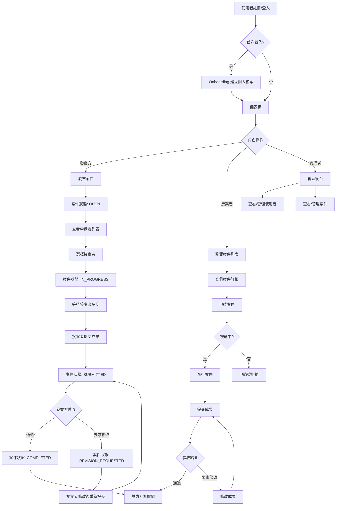
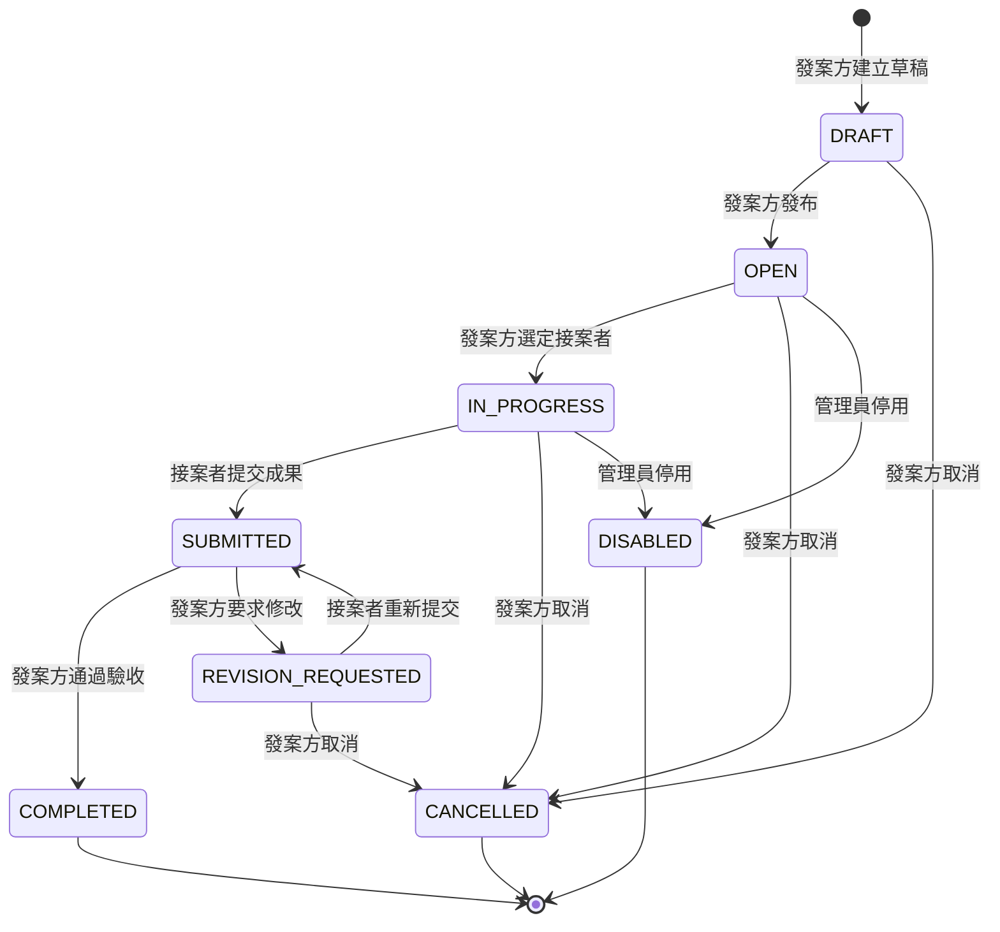

# 接案平台 MVP 產品需求文檔（PRD）

---

## 一、專案資訊

| 項目 | 內容 |
|------|------|
| **語言** | 繁體中文 |
| **前端框架** | Next.js 14+ / React 18 / TypeScript（App Router） |
| **後端** | Next.js Server Actions + API Routes（TypeScript，無需獨立 Python 後端） |
| **UI** | Tailwind CSS + shadcn/ui |
| **認證服務** | Clerk（Google 登入 + 郵箱登入） |
| **資料庫** | PostgreSQL（推薦 Supabase 免費方案），ORM：Prisma |
| **部署** | Vercel（前端 + Server Actions）+ Supabase（PostgreSQL） |
| **檔案儲存** | MVP 階段使用 URL 欄位 |
| **多幣別** | TWD、USD、JPY、HKD、CNY |
| **專案名稱** | `freelancer_platform_mvp` |

### 後端與資料庫選擇說明

> **不需要 Python 後端。** Next.js 的 Server Actions 和 API Routes 本身就是後端，全部使用 TypeScript 可以前後端型別共享，開發效率最高。如果你熟悉 Python，可以在未來用於資料分析或 AI 模組（如 Agent 輔助審核案件詳情的後端），但核心業務邏輯保持在 Next.js 內。

**資料庫服務推薦：**

| 服務 | 免費方案 | 適合場景 | 推薦度 |
|------|---------|----------|--------|
| **Supabase** | 500MB DB、2 專案 | 最適合 MVP，內建 REST API、Row Level Security、Dashboard | ⭐⭐⭐ |
| **Neon** | 0.5GB、1 專案 | Serverless PostgreSQL，冷啟動快，與 Vercel 整合佳 | ⭐⭐ |
| **Vercel Postgres** | 需付費 | 與 Vercel 深度整合，適合正式上線後 | ⭐ |

> **建議：MVP 階段使用 Supabase 免費方案。** Prisma 作為 ORM，未來更換資料庫服務只需改連線字串，無需改程式碼。

### 原始需求複述

建立一個接案平台 MVP，讓發案方可以發布案件、選擇接案者、驗收成果與評價；接案者可以瀏覽案件、申請案件、提交成果與評價；平台管理者可以查看並管理所有案件與使用者。MVP 階段聚焦核心流程，不包含線上付款、站內聊天、AI 功能等進階特性。

---

## 二、產品定義

### 2.1 產品目標

1. **建立可信賴的接案交易閉環**：讓發案方與接案者能透過平台完成從發布、媒合、交付到評價的完整交易流程，降低雙方的信任成本。

2. **提供透明高效的案件媒合機制**：透過結構化的案件發布與申請流程，讓發案方能快速篩選合適的接案者，接案者也能清晰展示自身能力。

3. **建構可營運的 MVP 基礎架構**：以最少功能集驗證核心價值，同時確保架構可擴展，為後續的付款、聊天、AI 推薦等進階功能預留擴展空間。

### 2.2 使用者故事

#### 發案方（Client）

| # | 使用者故事 |
|---|-----------|
| US-01 | 作為一個發案方，我希望能快速發布案件，填寫案件名稱、分類、背景、交付標準與獎金等資訊，以便清晰傳達我的需求。 |
| US-02 | 作為一個發案方，我希望能查看申請我案件的接案者列表及其申請內容，以便做出最佳的選擇。 |
| US-03 | 作為一個發案方，我希望能驗收接案者提交的成果，決定通過或要求修改，以確保交付品質符合預期。 |
| US-04 | 作為一個發案方，我希望能對合作完成的接案者進行評價，以便未來其他發案方能參考過往合作紀錄。 |
| US-10 | 作為一個發案方，我希望在發布案件表單中填寫完案件詳情後，能點擊「AI 輔助審核」按鈕，讓 Agent 自動檢查描述完整性與清晰度，並獲得具體改進建議（如「您的交付標準不夠具體，建議補充可衡量的指標」），以提升案件描述品質。此功能為可選，發案方可跳過直接發布。 |
| US-11 | 作為一個不熟悉技術的發案方，我希望能透過以下方式填寫案件所需的技能標籤：(1) 從預設技能分類勾選而非強制自由輸入；(2) 根據案件分類自動推薦常見技能標籤；(3) 用通俗語言描述需求（如「我需要一個購物網站」），由系統自動建議對應技術技能，以解決不瞭解技術術語而無法準確描述需求的問題。 |

#### 接案者（Freelancer）

| # | 使用者故事 |
|---|-----------|
| US-05 | 作為一個接案者，我希望能瀏覽平台上的案件列表，並透過關鍵字、分類與技能篩選，快速找到適合我專業的案件。 |
| US-06 | 作為一個接案者，我希望能向感興趣的案件提交申請，附上我的方案說明、預計完成天數與相關作品，以展示我的能力。 |
| US-07 | 作為一個被選中的接案者，我希望能提交成果（包含說明、Demo URL、GitHub URL 等），讓發案方驗收。 |
| US-08 | 作為一個接案者，我希望能對合作的發案方進行評價，分享我的合作體驗，幫助其他接案者做判斷。 |

#### 平台管理者（Admin）

| # | 使用者故事 |
|---|-----------|
| US-09 | 作為一個平台管理者，我希望能查看平台上所有使用者與案件，並能停用違規的使用者或案件，以維護平台秩序。 |
| US-12 | 作為一個平台管理者，我希望能查看平台統計數據儀表板（包含總案件數、總使用者數、進行中案件數、完成率等關鍵指標），以便快速掌握平台營運狀況並做出數據驅動的決策。 |
| US-13 | 作為一個平台管理者，我希望平台能支援對「新註冊使用者」（完成 Onboarding 後的使用者）或「新發布案件」（從 DRAFT 發布為 OPEN 的案件）進行審核控制。MVP 預設為「自動通過」（即使用者註冊後立即啟用、案件發布後立即公開），但系統需預留開關，允許管理員在後台切換為「人工審核」模式（審核通過後才啟用/公開），以確保平台內容品質與使用者可信度。 |
| US-14 | 作為一個平台管理者，我希望能接收並處理使用者舉報或投訴（如接案者舉報發案方不付款、發案方舉報交付品質不佳等），並能對被舉報方採取警告或停用等措施，以維護平台的公平與安全。 |
| US-15 | 作為一個平台管理者，我希望能維護平台的案件分類與技能標籤（新增、編輯、刪除、啟用/停用預設分類與標籤），以確保分類體系隨市場需求與技術演進保持同步更新。 |
| US-16 | 作為一個平台管理者，我希望能發送平台公告或通知給所有使用者（如系統維護公告、政策更新、新功能上線等），以便即時且統一地傳達重要資訊。 |
| US-17 | 作為一個平台管理者，我希望能查看交易糾紛記錄（包含糾紛類型、涉及案件、雙方陳述、處理狀態與結果），以便追蹤與分析平台糾紛趨勢，擬定預防措施。 |

#### 通用（General）

| # | 使用者故事 |
|---|-----------|
| US-18 | 作為一個新使用者，我希望第一次登入後能透過引導流程建立個人檔案（技能、經歷、聯絡方式等），以便後續發案或接案。 |

---

## 三、需求池（Requirements Pool）

### P0 - 必須有（MVP 上線必要功能）

| ID | 功能 | 說明 | 對應故事 |
|----|------|------|----------|
| REQ-01 | Google / 郵箱登入 | Clerk 整合，支援兩種登入方式 | US-01~18 |
| REQ-02 | 首次登入引導（Onboarding） | 建立本地 User 與 Clerk User ID 關聯，填寫個人檔案 | US-18 |
| REQ-03 | 發案方發布案件 | 完整欄位表單（名稱、分類、背景、敘述、交付成果、驗收標準、獎金、期限、技能、保密要求、參考資料）；技能欄位支援非技術型發案方的勾選式填寫 | US-01, US-11 |
| REQ-04 | 案件列表頁 | 顯示摘要資訊，支援關鍵字搜尋、分類/技能/狀態篩選 | US-05 |
| REQ-05 | 案件詳細頁 | 完整案件資訊 + 發案方基本資訊；根據角色與狀態顯示不同操作按鈕 | US-02, US-05 |
| REQ-06 | 接案者申請案件 | 申請表單（說明、預計完成方式、天數、作品 URL、補充說明）；不可重複申請、不可申請自己的案件 | US-06 |
| REQ-07 | 發案方選擇接案者 | 查看申請者列表與申請內容；選定後案件狀態變更為 IN_PROGRESS，其他申請者自動 REJECTED | US-02 |
| REQ-08 | 接案者提交成果 | 提交表單（說明、Demo/GitHub/文件/檔案 URL）；狀態變更為 SUBMITTED | US-07 |
| REQ-09 | 發案方驗收成果 | 顯示原始需求與提交成果對照；可通過（→COMPLETED）或要求修改（→REVISION_REQUESTED） | US-03 |
| REQ-10 | 接案者修改後重新提交 | 發案方要求修改後，接案者可查看修改要求並重新提交 | US-03, US-07 |
| REQ-11 | 雙方評價 | 案件完成後雙方可互相評價（1~5 分 + 文字 + 是否願意再次合作）；每人每案件限評一次 | US-04, US-08 |
| REQ-12 | 案件狀態管理 | 完整狀態流轉：DRAFT → OPEN → IN_PROGRESS → SUBMITTED → COMPLETED / REVISION_REQUESTED → CANCELLED / DISABLED | US-01~08 |
| REQ-13 | 權限控制 | 基於 Clerk 的頁面保護；API / Server Actions 層級的角色權限驗證 | 全域 |

### P1 - 應該有（提升體驗，可延後至 v1.1）

| ID | 功能 | 說明 | 對應故事 |
|----|------|------|----------|
| REQ-14 | 管理員後台 - 使用者管理 | 查看所有使用者列表、停用/恢復使用者 | US-09 |
| REQ-15 | 管理員後台 - 案件管理 | 查看所有案件列表、停用/恢復案件 | US-09 |
| REQ-16 | 管理員儀表板概覽 | 平台關鍵數據：總案件數、總使用者數、進行中案件數、完成率 | US-12 |
| REQ-17 | 個人儀表板（Dashboard） | 發案方：我發布的案件狀態總覽；接案者：我的申請/進行中/已完成案件 | US-01~08 |
| REQ-18 | 案件草稿功能 | 發案方可儲存草稿（DRAFT 狀態），稍後再編輯發布 | US-01 |
| REQ-19 | 案件編輯 | 發案方可編輯自己發布的案件（限 DRAFT 或 OPEN 狀態） | US-01 |
| REQ-25 | Agent 輔助審核案件詳情 | 發案方填寫案件詳情後可點擊「AI 輔助審核」，Agent 自動檢查描述完整性並給出改進建議（可跳過） | US-10 |
| REQ-26 | 舉報/投訴處理 | 管理員可接收並處理使用者舉報，對被舉報方採取警告或停用措施 | US-14 |
| REQ-27 | 分類與技能標籤維護 | 管理員可新增、編輯、刪除、啟用/停用預設的案件分類與技能標籤 | US-15 |

### P2 - 可以有（錦上添花，可延後至 v1.2+）

| ID | 功能 | 說明 | 對應故事 |
|----|------|------|----------|
| REQ-20 | 使用者個人頁面 | 公開的個人資料頁面，展示技能、作品連結、過往評價 | US-05, US-06 |
| REQ-21 | 案件收藏/追蹤 | 接案者可收藏感興趣的案件 | US-05 |
| REQ-22 | 通知系統 | 案件狀態變更時發送 Email 通知 | US-16 |
| REQ-23 | 搜尋進階功能 | 獎金範圍篩選、期限範圍篩選、排序功能 | US-05 |
| REQ-24 | 分頁功能 | 案件列表與管理後台的分頁載入 | US-05, US-09 |
| REQ-28 | 審核機制 | 提供審核模式開關：預設「自動通過」（新使用者 Onboarding 後直接啟用、案件發布後直接公開）；管理員可切換為「人工審核」模式（需審核通過才啟用/公開）。「新註冊使用者」定義為完成 Onboarding 但尚未被審核的使用者；「新發布案件」定義為從 DRAFT 發布為 OPEN 但尚未被審核的案件 | US-13 |
| REQ-29 | 平台公告 | 管理員可發送平台公告或通知給所有使用者 | US-16 |
| REQ-30 | 交易糾紛記錄 | 管理員可查看交易糾紛記錄（類型、涉及案件、雙方陳述、處理狀態） | US-17 |

---

## 四、流程圖

### 4.1 核心業務流程

### 4.2 案件狀態流轉

---

## 五、UI 設計要點

### 5.1 公開頁面

#### 首頁（/）
- **佈局**：Hero 區塊 + 平台特色簡介 + 熱門案件預覽 + CTA（開始發案 / 開始接案）
- **設計重點**：清楚傳達平台價值主張，引導使用者註冊或登入
- **元件**：導航列（Logo + 登入按鈕）、Hero Banner、特色卡片、CTA 按鈕

#### 登入/註冊頁（/sign-in, /sign-up）
- **佈局**：中央卡片式表單
- **設計重點**：Clerk 嵌入式元件，Google 登入按鈕 + 郵箱登入表單
- **元件**：Clerk SignIn / SignUp Component

#### 案件列表（/projects）
- **佈局**：頂部搜尋與篩選列 + 案件卡片網格（或列表）
- **設計重點**：
  - 搜尋欄：關鍵字輸入
  - 篩選器：分類下拉、技能標籤、狀態篩選
  - 案件卡片：名稱、分類標籤、獎金、期限、技能標籤、申請人數、狀態標籤、發布時間
- **元件**：SearchBar、FilterGroup、ProjectCard、Pagination

#### 案件詳細頁（/projects/[projectId]）
- **佈局**：左欄案件資訊 + 右欄發案方資訊卡片 + 底部操作區
- **設計重點**：
  - 完整顯示所有案件欄位
  - 根據登入狀態與角色顯示不同操作按鈕：
    - 未登入：提示登入
    - 接案者（非自己的案件）：申請按鈕
    - 發案方（自己的案件）：查看申請者按鈕
    - 已申請者：顯示申請狀態
- **元件**：Breadcrumb、ProjectDetail、ClientInfoCard、ActionButton

### 5.2 認證頁面（需登入）

#### Onboarding（/onboarding）
- **佈局**：多步驟表單（Step 1: 基本資訊 → Step 2: 技能與經歷 → Step 3: 角色選擇）
- **設計重點**：
  - 步驟進度指示器
  - 角色選擇：發案方 / 接案者 / 兩者皆是
  - 技能輸入：標籤式輸入
- **元件**：StepIndicator、RoleSelector、SkillTagInput、ProfileForm

#### 儀表板（/dashboard）
- **佈局**：側邊導航 + 主內容區
- **設計重點**：
  - 發案方視角：我發布的案件統計（進行中/待驗收/已完成）+ 案件列表快速入口
  - 接案者視角：我的申請統計（審核中/進行中/已完成）+ 案件列表快速入口
- **元件**：Sidebar、StatCard、ProjectQuickList

#### 發布案件（/projects/new）
- **佈局**：單頁長表單，分區塊顯示
- **設計重點**：
  - 區塊分組：基本資訊（名稱、分類）、案件詳情（背景、敘述、交付成果、驗收標準）、條件設定（獎金、期限、技能、保密要求）、附加資訊（參考資料）
  - 支援儲存草稿與直接發布
- **元件**：FormSection、RichTextEditor、DatePicker、SkillTagInput、DraftSaveButton

#### 申請案件（/projects/[projectId]/apply）
- **佈局**：彈窗或獨立頁面表單
- **設計重點**：申請說明（textarea）、預計完成方式（textarea）、預計完成天數（number input）、相關作品 URL（動態新增）、補充說明（textarea）
- **元件**：ApplicationForm、DynamicUrlList

#### 查看申請者（/projects/[projectId]/applications）
- **佈局**：申請者列表 + 點擊展開詳細申請內容
- **設計重點**：每個申請者卡片顯示頭像、名稱、技能標籤、預計天數；展開後顯示完整申請內容與作品連結；選擇按鈕（確認選擇）
- **元件**：ApplicantCard、ApplicantDetail、ConfirmDialog

#### 提交成果（/projects/[projectId]/submit）
- **佈局**：表單頁面
- **設計重點**：成果說明（textarea）、Demo URL、GitHub URL、文件 URL、檔案 URL、補充說明
- **元件**：SubmissionForm、DynamicUrlList

#### 驗收成果（/projects/[projectId]/review-submission）
- **佈局**：左右對照面板
- **設計重點**：
  - 左側：原始需求與驗收標準（唯讀）
  - 右側：接案者提交的成果內容
  - 底部：通過按鈕 / 要求修改按鈕（點擊後彈出修改原因、要求、期限表單）
- **元件**：ComparisonPanel、AcceptButton、ReviseDialog

#### 評價頁（/projects/[projectId]/review）
- **佈局**：中央卡片式表單
- **設計重點**：星級評分（1~5）、文字評價（textarea）、是否願意再次合作（toggle/radio）
- **元件**：StarRating、ReviewForm

### 5.3 管理員頁面

#### 管理員後台（/admin）
- **佈局**：側邊導航 + 儀表板概覽
- **設計重點**：關鍵數據卡片 + 快速入口
- **元件**：AdminSidebar、AdminStatCard

#### 使用者管理（/admin/users）
- **佈局**：表格視圖 + 搜尋
- **設計重點**：使用者列表（名稱、Email、角色、狀態、註冊時間）、停用/恢復操作
- **元件**：AdminTable、StatusBadge、ToggleButton

#### 案件管理（/admin/projects）
- **佈局**：表格視圖 + 搜尋 + 篩選
- **設計重點**：案件列表（名稱、發案方、接案者、狀態、時間）、停用/恢復操作
- **元件**：AdminTable、StatusBadge、ToggleButton

---

## 六、待確認問題（已確認）

| # | 問題 | 決議 | 狀態 |
|---|------|------|------|
| Q-01 | 案件獎金欄位是否需要支援多幣別？ | ✅ 支援多幣別：TWD、USD、JPY、HKD、CNY | **已確認** |
| Q-02 | 案件分類與技能標籤是自由輸入還是預設選項？ | ✅ 使用預設分類 + 自由輸入技能標籤（詳見下方分類表） | **已確認** |
| Q-03 | 發案方「要求修改」是否有次數限制？ | ✅ 不設限制，但記錄修改次數供後續分析 | **已確認** |
| Q-04 | 案件取消的權限？ | ✅ 僅發案方可取消（限 OPEN / IN_PROGRESS / REVISION_REQUESTED），需填寫取消原因 | **已確認** |
| Q-05 | 雙方評價是否互相可見？評價後是否可修改？ | ✅ 雙方都完成評價後才互相可見；提交後不可修改 | **已確認** |
| Q-06 | 個人檔案的照片與檔案是否需要上傳？ | ✅ MVP 使用 URL 欄位，Clerk 內建頭像即可 | **已確認** |
| Q-07 | 是否需要 Email 通知系統？ | ✅ MVP 使用 Clerk 內建郵件 + 平台內狀態顯示 | **已確認** |
| Q-08 | 管理員權限如何設定？ | ✅ 透過資料庫 `isAdmin` 欄位手動設定 | **已確認** |

### Q-02 預設案件分類與技能標籤設計

#### 案件分類（6 大類）

| 分類 | 說明 | 常見案件範例 |
|------|------|-------------|
| **網站開發** | 各類網站與 Web 應用開發 | 企業官網、電商網站、後台管理系統、API 開發 |
| **App 開發** | 行動應用程式開發 | iOS/Android App、React Native/Flutter 跨平台開發 |
| **設計** | 視覺與 UI/UX 設計 | Logo 設計、海報/文宣、UI/UX 設計、品牌識別 |
| **文案** | 各類文字內容創作 | 廣告文案、SEO 文章、產品說明、社群貼文 |
| **行銷** | 數位行銷與推廣 | SEO 優化、社群經營、廣告投放、數據分析 |
| **資料分析** | 數據處理與分析 | 資料清洗、報表製作、數據視覺化、Python/R 分析 |

#### 技能標籤（依分類推薦，發案方可自由新增）

| 分類 | 推薦技能標籤 |
|------|-------------|
| 網站開發 | React、Vue、Angular、Next.js、Node.js、TypeScript、PHP、Laravel、WordPress、MySQL、MongoDB、AWS、Docker |
| App 開發 | React Native、Flutter、Swift、Kotlin、Java、Firebase、REST API |
| 設計 | Figma、Adobe Photoshop、Adobe Illustrator、Adobe XD、Sketch、Canva |
| 文案 | 廣告文案、SEO 寫作、品牌故事、技術文件、社群文案 |
| 行銷 | Google Ads、Facebook Ads、SEO、GA4、社群經營、內容行銷 |
| 資料分析 | Python、R、SQL、Excel、Tableau、Power BI、Pandas、機器學習 |

> 發案方可從推薦標籤勾選，也可自由輸入自訂技能；系統根據案件分類自動顯示對應推薦標籤。

---

## 七、非功能性需求

| 類別 | 需求 |
|------|------|
| **效能** | 案件列表頁面載入時間 ≤ 2 秒（首屏）；API 回應時間 ≤ 500ms（P95） |
| **安全性** | 所有 API / Server Actions 必須驗證 Clerk Session；禁止跨使用者資料存取；Input 必須做 Server-side validation |
| **可用性** | 支援桌面端與行動端 RWD；主要操作流程（發布案件、申請、提交、驗收）應 ≤ 5 步驟 |
| **可維護性** | 遵循 Next.js App Router 慣例；使用 TypeScript strict mode；Prisma Schema 作為單一資料真相來源 |
| **可擴展性** | 資料庫設計預留擴展欄位；案件狀態機設計允許新增狀態；角色權限設計支援未來新增角色 |

---

## 八、MVP 驗收標準

1. 使用者可透過 Google 帳號或郵箱註冊並登入
2. 首次登入後可完成 Onboarding 建立個人檔案
3. 發案方可成功發布案件（包含所有必填欄位）
4. 案件列表可依照關鍵字、分類、技能、狀態進行篩選
5. 接案者可成功申請案件（不可重複申請）
6. 發案方可查看申請者並選擇一位接案者
7. 接案者可提交成果（含多個 URL 欄位）
8. 發案方可驗收成果，選擇通過或要求修改
9. 要求修改後接案者可重新提交
10. 案件完成後雙方可互相評價
11. 管理員可查看所有使用者與案件，並執行停用/恢復操作
12. 所有頁面在行動裝置上可正常使用（RWD）

---

*文檔版本：v1.0 | 作者：許清楚（產品經理） | 日期：2025-06-05*
